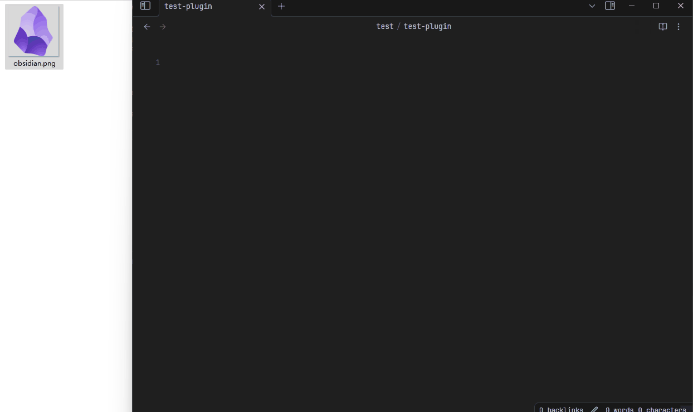

# WebDAV Image Uploader

This is an Obsidian (https://obsidian.md) plugin for managing local images by storing them on WebDAV server, and previewing them via links (``):

- Upload, download, and delete images in notes.
- Batch upload or download images from the entire vault (to/from the WebDAV server).

## Features

### Upload, Download, and Delete Files

- When pasting or dragging images into a note, the plugin will intercept the action, upload the image to the WebDAV server according to the configured path format (Plugin Settings -> Basic -> Path Format), and then insert a preview link for the image (``). You can enable/disable it in the plugin settings, or execute `WebDAV Manager: Toggle auto upload` command.
- You can also right-click on a local image link (``) and select the `Upload file to WebDAV` option from the menu to upload the image and insert the link. You can configure whether to keep the local file after a successful upload.
- When right-clicking a preview link, you can select `Download file from WebDAV` to download the image locally. The path is related to your Obsidian configuration (Settings -> Files & Links).
- When right-clicking a preview link, you can select `Delete file from WebDAV` to delete the image from the WebDAV server and remove the link from the note.

### Batch Upload/Download

In the Plugin Settings -> Commands, some buttons are provided for batch uploading and downloading images:

- Read all notes in the vault, and upload all local images (``) to the WebDAV server.
- Read all notes in the vault, and download all remote images (``) to locally.

**Note: These features have not been thoroughly tested (only run once in my vault). Please be sure to back up your vault before running them to prevent damage due to bugs.**

## Others

### About Image Preview

WebDAV may require [Http Authentication](https://developer.mozilla.org/en-US/docs/Web/HTTP/Guides/Authentication) to verify permissions when accessing files. But Obsidian (CodeMirror) does not seem to provide an API to add request headers for requests sent by ``. Therefore, this plugin intercepts and replaces image links, manually fetching and displaying the images. This display behavior differs from Obsidian's default behavior and may result in loading failures(in rare cases).

If you do not need this feature (when your server has disabled access verification), you can disable it in the plugin settings (**you may need to restart Obsidian after switching**). If you have a better solution, Pull Requests are welcome.

### About This Plugin

This plugin was primarily written for my personal use to replace the [image-auto-upload](https://github.com/renmu123/obsidian-image-auto-upload-plugin) plugin, due to it requires running an additional `PicGo` locally, and it does not offer a feature to upload images for the entire vault (I have thousands of nots needs to process).

After trying my plugin out for a few days, I feel that it already meets my needs: uploading all images to WebDAV (even though it only ran once), and then easily uploading and downloading images within notes (with the ability to conveniently delete them when something goes wrong).

## Inspired by

[obsidian-image-auto-upload-plugin](https://github.com/renmu123/obsidian-image-auto-upload-plugin)
